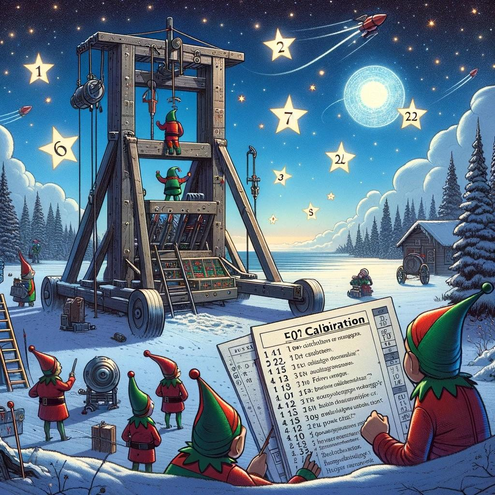

## --- Day 1: Trebuchet?! ---

Something is wrong with global snow production, and you've been selected to take a look. The Elves have even given you a map; on it, they've used stars to mark the top fifty locations that are likely to be having problems.


You've been doing this long enough to know that to restore snow operations, you need to check all *fifty stars* by December 25th.


Collect stars by solving puzzles. Two puzzles will be made available on each day in the Advent calendar; the second puzzle is unlocked when you complete the first. Each puzzle grants *one star*. Good luck!


You try to ask why they can't just use a [weather machine](/2015/day/1) ("not powerful enough") and where they're even sending you ("the sky") and why your map looks mostly blank ("you sure ask a lot of questions") and hang on did you just say the sky ("of course, where do you think snow comes from") when you realize that the Elves are already loading you into a [trebuchet](https://en.wikipedia.org/wiki/Trebuchet) ("please hold still, we need to strap you in").


As they're making the final adjustments, they discover that their calibration document (your puzzle input) has been *amended* by a very young Elf who was apparently just excited to show off her art skills. Consequently, the Elves are having trouble reading the values on the document.


The newly-improved calibration document consists of lines of text; each line originally contained a specific *calibration value* that the Elves now need to recover. On each line, the calibration value can be found by combining the *first digit* and the *last digit* (in that order) to form a single *two-digit number*.


For example:


```
1abc2
pqr3stu8vwx
a1b2c3d4e5f
treb7uchet

```

In this example, the calibration values of these four lines are `12`, `38`, `15`, and `77`. Adding these together produces `*142*`.


Consider your entire calibration document. *What is the sum of all of the calibration values?*


## --- Part Two ---

Your calculation isn't quite right. It looks like some of the digits are actually *spelled out with letters*: `one`, `two`, `three`, `four`, `five`, `six`, `seven`, `eight`, and `nine` *also* count as valid "digits".


Equipped with this new information, you now need to find the real first and last digit on each line. For example:


```
two1nine
eightwothree
abcone2threexyz
xtwone3four
4nineeightseven2
zoneight234
7pqrstsixteen

```

In this example, the calibration values are `29`, `83`, `13`, `24`, `42`, `14`, and `76`. Adding these together produces `*281*`.


*What is the sum of all of the calibration values?*


## Comments / Notes
It was fun knocking the rust off my coding and git skills. 
For Problem 2, I was programming the way I wanted to, but realized I wanted to look up other ways I could do this using Regex. Sadly that turned out not be the answer b/c of the possibility of overlapping words, such as "twone" should be converted to "21".

## AI Art of the Scenario
Source: https://www.reddit.com/r/adventofcode/comments/1897f8g/2023_day_1_lets_prepare_the_trebuchet/
