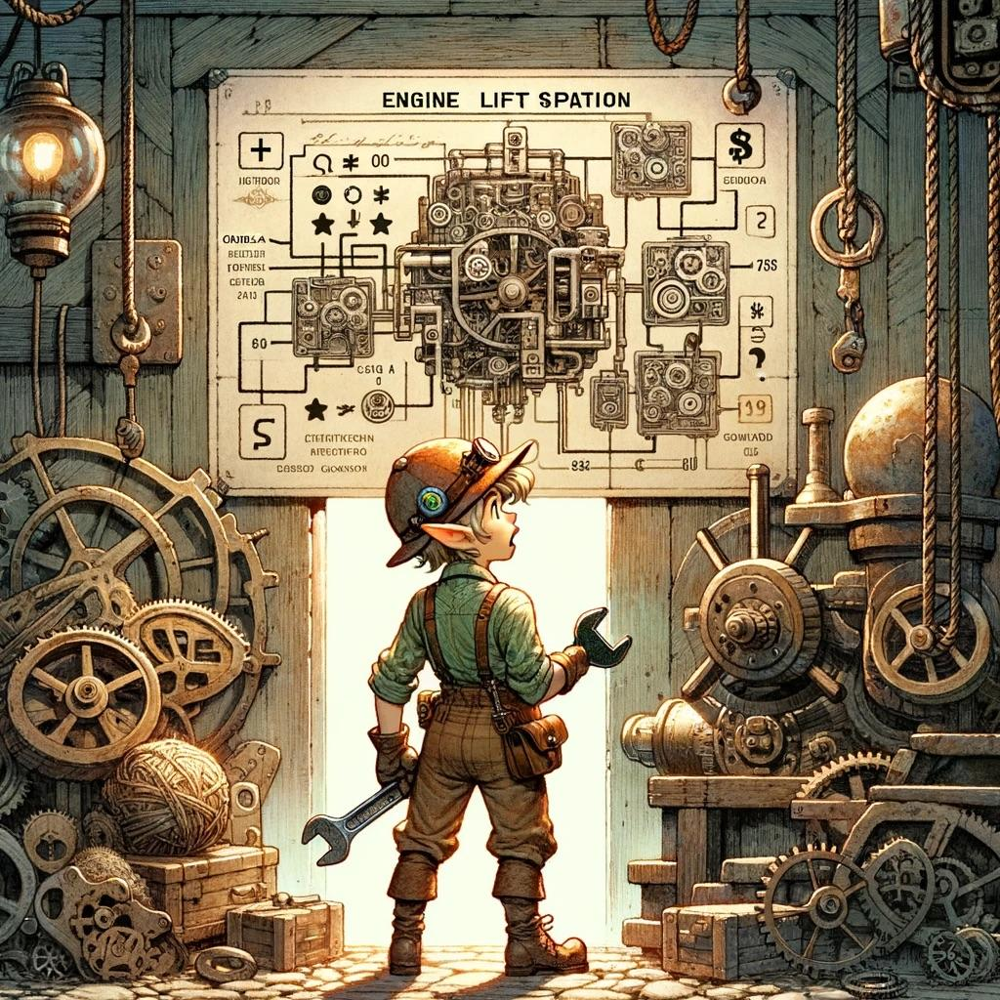

## Comments
12/3/2023 - finally taking the time to properly learn git branches so I'm not innundating the main with updates for any willynilly change for reasons like "I'm going to a coffee shop and going to work on my iPad instead of my computer and need the code updated to work from". This has been a long time coming - and since I don't collab code in anyway at work I've not had to learn this yet. It's a lot to learn

Today took MUCh longer than I thought it would.
- Jumped the shark, like usual, and assumed prb 2 would be much harder where I'd need a more robust way of finding the distance between 2D objects. So, I over-prepared during prb1 and was stuck in the mindset sticking with that solution I was trying to make work. 
- Re-learning to debug quickly and pivot when a solution I was playing with is getting too complicated. Hopefully I'll be able to visualize these solution alternatives quicker and not waste as much time trying to code these.

Need to keep myself aware of mistakes so I stumble less as I keep going.

## AI Art of the Scenario
Source: https://www.reddit.com/r/adventofcode/comments/18afp9b/2023_day_3_ai_art_lets_fix_this/
