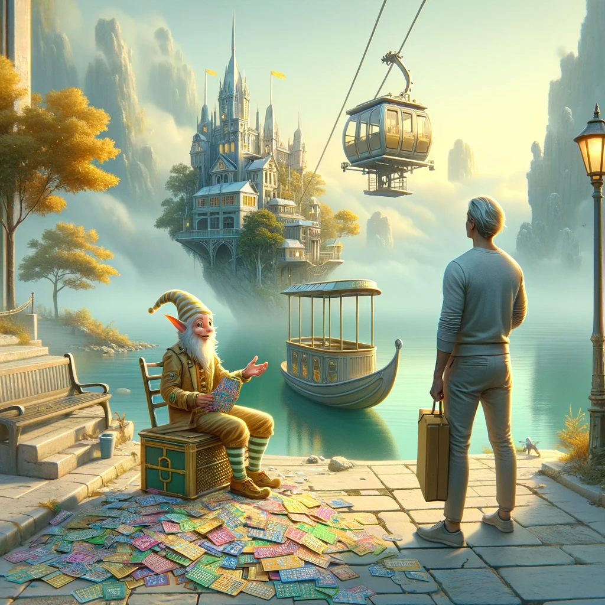

## Comments
After reading this problem I was relieved that my mind picked up easy solutions right away (compared to yesterday). Problem 1 was easy, and while Problem 2 felt like a bit of a challenge, I figured out how to not use recursion and was very proud of myself!!

Worked a bit more on learning git branches. It's so hard!! Brute forced myself to update and sync branches on my work laptop - after updating things from home. Friend said they, after a year, finally feel comfortable working git and offered help. Definitely going to take him up on that.

## AI Art of the Scenario
Source: https://www.reddit.com/r/adventofcode/comments/18akjce/2023_day_4_ai_art_scratchcards/
