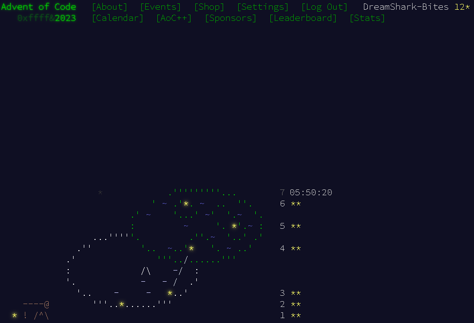

Another year, another AdeventOfCode. 
Excited, and nervous for this one, but coming in overall more confident than last year I think. Even though I know how hard and time consuming the problems can be, I know a little better what I'm getting into. 

Discovered that people were making AI Art

# What I hope to gain
- more exerpience using Git
	- last year it was hard to setup and maintain. I loved the Markdown conversions of the problem, but it was annoying to do. That will certainly NOT be a requirement for each Day this time. I will add comments & thoughts on the day's problems though in journal style entries. 
	- I still plan on using my lil'RaspberryPi at the start like I did last time, but the lack of IDE functions really hit me hard. Hoping to look into alternatives so I can code on the go (my iPad). 
- healthy work-life balance
	- avoid burnout: time management will be good here
	- mindset: while it would be nice to do all 25 days (50 stars), my goal is to see if I can complete more problems than last year - which was 31 stars: 15 full days and 16th day was only partial. 
- automatically convert problems to markdown for GitHub README pages
	- I'd like to try and scrape the website for it's problems and convert those into Markdown through a script, but the issue is that the 2nd problem only shows itself after YOU complete the 1st one, and you need to be logged in for that. Unsure how to handle that OAuth stuff.
 
# What I've learned/relearned (so far)
- reading closely and critically
- make code readable and flexible enough for easier future itterations but don't over-prepare for the unknown.
- reducing risk of burnout: 
	- frequent breaks. 
	- by allowing myself to go on tagents at the start of the project (html to markdown thing)

## Current Progress
<<<<<<< HEAD

=======

## AI Art of the event
source is Microsoft Bing

>>>>>>> problem-wip
